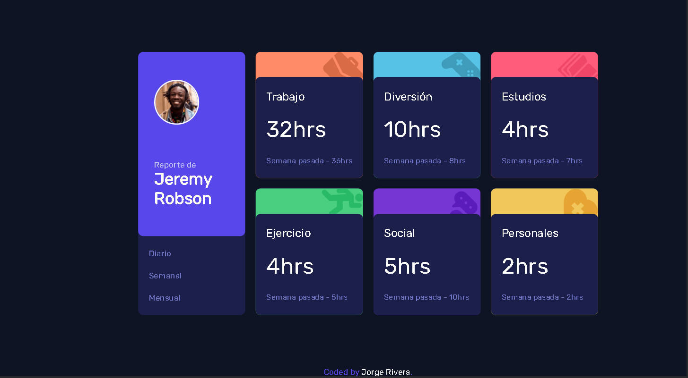
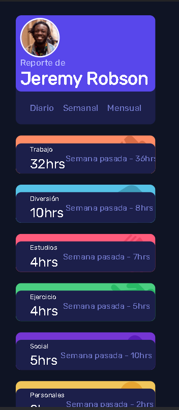

## Table of contents

- [Overview](#overview)
  - [The challenge](#the-challenge)
  - [Screenshot](#screenshot)
  - [Links](#links)
- [My process](#my-process)
  - [Built with](#built-with)
  - [What I learned](#what-i-learned)
  - [Useful resources](#useful-resources)
- [Author](#author)


## Overview

### The challenge

Users should be able to:

- View the optimal layout for the site depending on their device's screen size
- See hover states for all interactive elements on the page
- Switch between viewing Daily, Weekly, and Monthly stats

### Screenshot




### Links


- Live Site URL: [https://time-tracking.jorgerivera.me]

## My process

### Built with

- Semantic HTML5 markup
- CSS custom properties
- Flexbox
- CSS Grid
- Desktop-first workflow
- Mobile-second workflow
- Js connection with data.json


### What I learned


For this project I learned to work with Json type data, thus making the queries more efficient.


```js
async function obtenerDatos(){
        const response = await fetch ("https://time-tracking.jorgerivera.me/data.json");
        const json = await response.json();
}
obtenerDatos();
```


### Useful resources

- [Datos Json](https://developer.mozilla.org/es/docs/Learn/JavaScript/Objects/JSON) - This helped me understand the structure of a Json format file.


## Author

- Website - [Jorge Rivera](https://www.jorgerivera.me)

